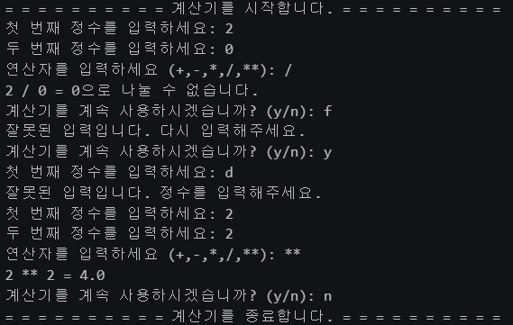
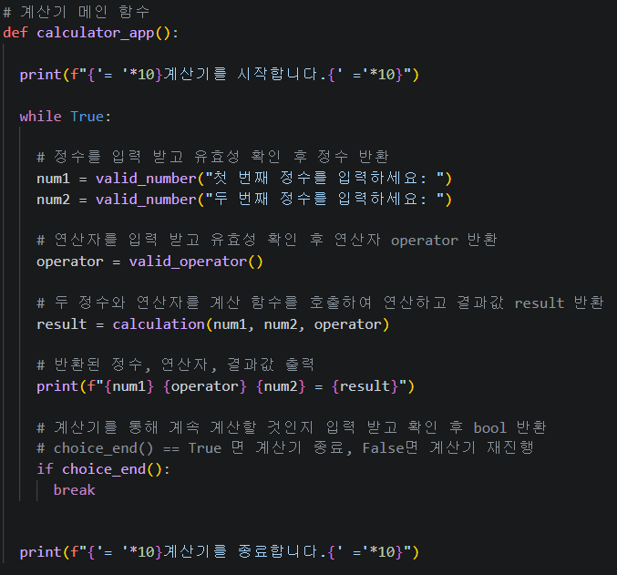
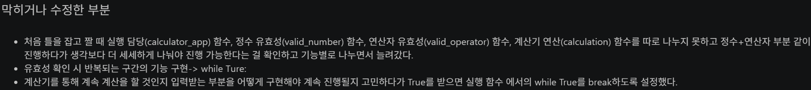
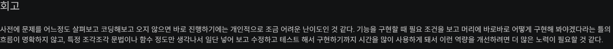
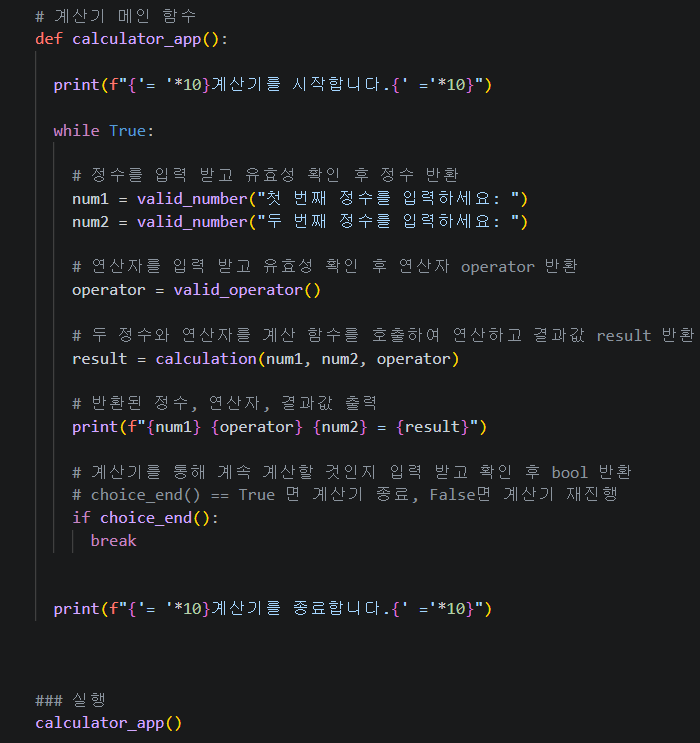

# AIFFEL Campus Online Code Peer Review Templete
- 코더 : 박애희
- 리뷰어 : 채진현


# PRT(Peer Review Template)
- [o]  **1. 주어진 문제를 해결하는 완성된 코드가 제출되었나요?**
    - 문제에서 요구하는 최종 결과물이 첨부되었는지 확인
        - 중요! 해당 조건을 만족하는 부분을 캡쳐해 근거로 첨부   
      
    요구하는 조건을 모두 만족하는 결과가 나오는 것을 확인할 수 있었습니다.   
    
- [o]  **2. 전체 코드에서 가장 핵심적이거나 가장 복잡하고 이해하기 어려운 부분에 작성된 
주석 또는 doc string을 보고 해당 코드가 잘 이해되었나요?**
    - 해당 코드 블럭을 왜 핵심적이라고 생각하는지 확인
    - 해당 코드 블럭에 doc string/annotation이 달려 있는지 확인
    - 해당 코드의 기능, 존재 이유, 작동 원리 등을 기술했는지 확인
    - 주석을 보고 코드 이해가 잘 되었는지 확인
        - 중요! 잘 작성되었다고 생각되는 부분을 캡쳐해 근거로 첨부   
      
    함수별, 코드별 실행에 대한 주석이 자세히 달려있었습니다.   
    
        
- [o]  **3. 에러가 난 부분을 디버깅하여 문제를 해결한 기록을 남겼거나
새로운 시도 또는 추가 실험을 수행해봤나요?**
    - 문제 원인 및 해결 과정을 잘 기록하였는지 확인
    - 프로젝트 평가 기준에 더해 추가적으로 수행한 나만의 시도, 
    실험이 기록되어 있는지 확인
        - 중요! 잘 작성되었다고 생각되는 부분을 캡쳐해 근거로 첨부   
      
    어느 부분에서 막히고 수정하였는지 따로 md를 통해 작성해두었습니다.
        
- [o]  **4. 회고를 잘 작성했나요?**
    - 주어진 문제를 해결하는 완성된 코드 내지 프로젝트 결과물에 대해
    배운점과 아쉬운점, 느낀점 등이 기록되어 있는지 확인
    - 전체 코드 실행 플로우를 그래프로 그려서 이해를 돕고 있는지 확인
        - 중요! 잘 작성되었다고 생각되는 부분을 캡쳐해 근거로 첨부   
      
    작성하며 아쉬운 점에 대한 회고가 작성되어 있었습니다.
        
- [o]  **5. 코드가 간결하고 효율적인가요?**
    - 파이썬 스타일 가이드 (PEP8) 를 준수하였는지 확인
    - 코드 중복을 최소화하고 범용적으로 사용할 수 있도록 함수화/모듈화했는지 확인
        - 중요! 잘 작성되었다고 생각되는 부분을 캡쳐해 근거로 첨부   
      
    코드를 실행 범위에 따라 함수를 여러개로 나누어 효율적으로 작성하였습니다.


# 회고(참고 링크 및 코드 개선)
```
# 리뷰어의 회고를 작성합니다.
# 코드 리뷰 시 참고한 링크가 있다면 링크와 간략한 설명을 첨부합니다.
# 코드 리뷰를 통해 개선한 코드가 있다면 코드와 간략한 설명을 첨부합니다.
```   
저는 간단한 코드를 작성하는데 있어 반복이 필요한 부분만 함수로 정의하여 사용하였었는데 실행하는 부분별로 함수를 나누어 사용했다는 점과
요구조건이 아니였음에도 입력받을 수 있는 범위를 제한하고 반복 입력하도록하여 정확한 입력을 유도한 점이 좋았습니다.   
개인적으론 코드를 한두줄 더 줄일 수 있으나 가독성을 위해 남겨도 상관없을 것같습니다.(ex. num, valid_operator부분은 return과 if문에 통합하여 사용할 수 있습니다.)   