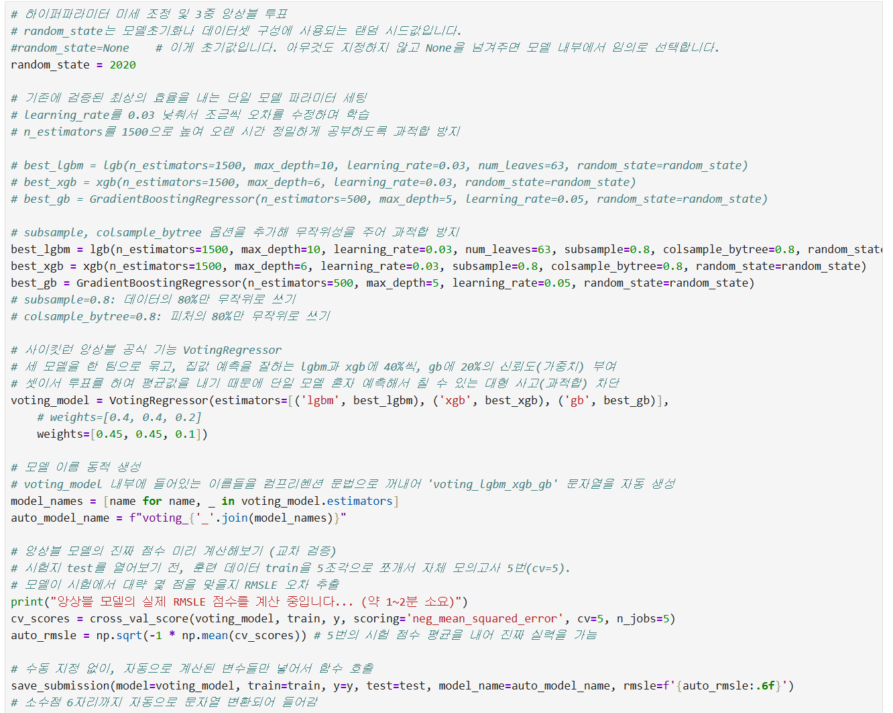
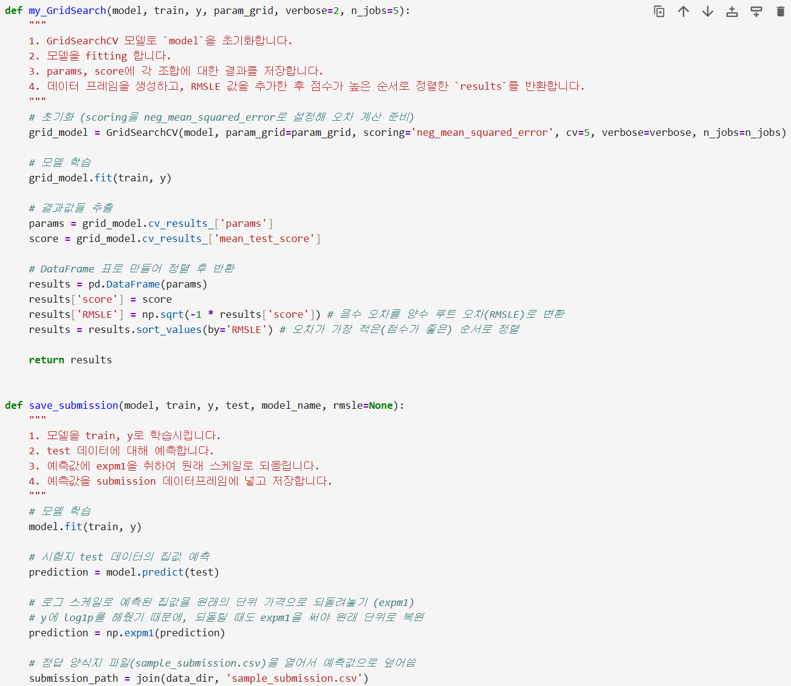
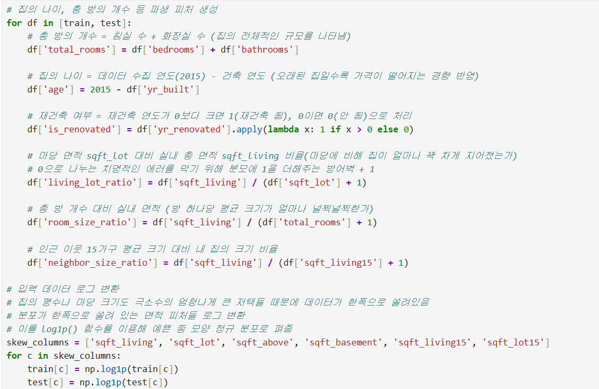
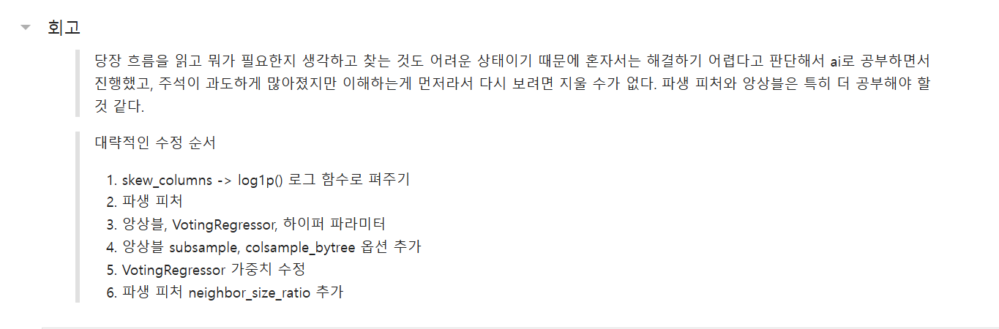

# AIFFEL Campus Online Code Peer Review Templete
- 코더 : 박애희  
- 리뷰어 : 임성배  


# PRT(Peer Review Template)
- [X]  **1. 주어진 문제를 해결하는 완성된 코드가 제출되었나요?**
    - 코드 제출 확인하였습니다.  
        
    
- [X]  **2. 전체 코드에서 가장 핵심적이거나 가장 복잡하고 이해하기 어려운 부분에 작성된 
주석 또는 doc string을 보고 해당 코드가 잘 이해되었나요?**
    - 각 단계마다 주석을 상세하게 기재하여 과정을 이해할 수 있도록 작성되었습니다.  
       
        
- [X]  **3. 에러가 난 부분을 디버깅하여 문제를 해결한 기록을 남겼거나
새로운 시도 또는 추가 실험을 수행해봤나요?**
    - 총 방의 개수, 집의 나이, 재건축 여부, 마당 면적 등 로우 데이터들을 재가공하여 학습 데이터에 신뢰를 높이고 결과를 개선한 점이 매우 신선했습니다.  
         
       
- [X]  **4. 회고를 잘 작성했나요?**
    - 진행 과정에서의 수정 순서 및 회고가 잘 작성되어 있었습니다.  
       

- [X]  **5. 코드가 간결하고 효율적인가요?**
    - 코드가 간결하고 효율적으로 작성되었습니다.  


# 회고(참고 링크 및 코드 개선)
```
# 리뷰어의 회고를 작성합니다.
# 코드 리뷰 시 참고한 링크가 있다면 링크와 간략한 설명을 첨부합니다.
# 코드 리뷰를 통해 개선한 코드가 있다면 코드와 간략한 설명을 첨부합니다.
```  
Ai의 학습 성능을 높이기 위해 차별화를 많이 시도한 점이 가장 눈에 띄었고 매우 참신하다고 생각되었습니다.  
노드 학습을 따라가기도 쉽지 않았기 때문에, 더 좋게 개선하려는 시도나 생각을 하지 못했는데 박애희님이 작성하신 코드를 보고 많은 도움이 되었습니다.  
수고하셨습니다.  
